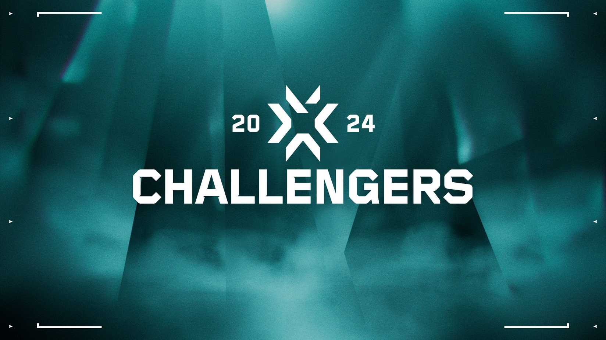

预览网址：https://hiderd.github.io/zzz.github.io/html/paiming.html

# 实验报告：Web 项目设计与开发实验

#### 作者：周全 

#### 指导老师：张勇 

#### 日期：11.9

## 摘要

本实验旨在设计和开发一个简单的网页项目，并通过提供的三个网页的HTML代码展示项目的部分内容。实验涉及到网页布局、导航栏设计、页面链接以及排名信息的展示。通过本实验，我们能够了解并掌握基本的网页设计与开发技能。

## 引言

Web 项目设计与开发已经成为当今互联网时代中至关重要的一门技能。本实验旨在通过实际操作，让学生们熟悉网页项目的设计与开发流程，包括页面结构的设计、样式表的应用、导航栏的实现以及内容的展示。通过这个实验，我们将学会如何将静态的网页布局转化为实际可点击、可交互的网页。

## 实验方法

1. **网页结构设计**：根据需求设计网页的整体结构，包括头部、导航栏、侧边栏和内容区域。
   - 头部：包含网站的标题和 logo。
   - 导航栏：包含各个页面的链接，确保导航栏在每个页面上保持一致。
   - 侧边栏：如果需要的话，设计并实现侧边栏来展示额外的信息或功能。
   - 内容区域：设计各个页面的内容展示区域，考虑页面布局和排版。

2. **样式表应用**：创建样式表并定义页面元素的外观和布局。
   - 使用 CSS 对页面元素进行样式定义，包括颜色、字体、边框等属性。
   - 确保页面在不同屏幕尺寸下能够良好地适配，采用响应式设计。

3. **导航栏实现**：设计并实现网页之间的导航链接。
   - 使用 HTML 的超链接标签 `<a>` 来实现页面之间的跳转。
   - 确保每个页面都能够从导航栏中直接跳转到其他页面。

4. **内容展示**：根据排名信息设计并展示相关内容。
   - 根据提供的排名信息，设计并展示相应的内容，可以是表格、列表或其他形式。

5. **页面链接**：确保各个页面之间能够相互跳转。
   - 在每个页面中设置正确的超链接，以便用户能够方便地在页面之间进行跳转和导航。


## 功能实现

```
总共有6个页面,目前已完成index.html   kanshikuang.html  paiming.html三个页面
```


- ## index.html

```html
<div class="bodya1">
					<div class="left">
						<span class="s1">最新消息 | 2023年10月20日</span>
						<span class="s2">隆重介紹2024VCT挑戰賽</span> <br />
						<span class="s3">今天我們要分享2024年《特戰英豪》挑戰賽的初步細節。</span><br />
						<a href="">閱讀更多</a>
					</div>
					<div class="right" id="slideshow">
					    
					    
					    
					    
					    
					</div>
					
					<script>
					    var slideshow = document.getElementById("slideshow");
					    var currentIndex = 0;
					    var images = slideshow.getElementsByTagName("img");
					    for (var i = 0; i < images.length; i++) {
					        if (i === currentIndex) {
					            images[i].style.display = "block";
					        } else {
					            images[i].style.display = "none";
					        }
					    }
					    setInterval(function() {
					        images[currentIndex].style.display = "none";
					        currentIndex = (currentIndex + 1) % images.length;
					        images[currentIndex].style.display = "block";
					    }, 3000);
					</script>
				</div>
```

> 这段代码是一个简单的 JavaScript 脚本，它实现了一个图片轮播效果。让我来逐步解释一下这段代码的功能。
>
> 1. 首先，通过 `var slideshow = document.getElementById("slideshow");` 这行代码获取了 id 为 "slideshow" 的 HTML 元素，预期这个元素是一个包含多张图片的容器。
>
> 2. 然后通过 `var currentIndex = 0;` 定义了一个变量 `currentIndex`，用于记录当前显示的图片的索引。
>
> 3. 接下来通过 `var images = slideshow.getElementsByTagName("img");` 获取了 `slideshow` 容器中所有的图片元素，并将其存储在一个数组 `images` 中。
>
> 4. 然后使用一个 for 循环遍历所有的图片元素。在循环中，如果当前的索引 `i` 等于 `currentIndex`，就将该图片元素的 `display` 样式设置为 "block"，否则设置为 "none"，以实现只显示当前索引对应的图片，其他图片隐藏起来。
>
> 5. 此后使用 `setInterval` 函数设置了一个定时器，每隔 3000 毫秒（即 3 秒），执行一次轮播操作。在定时器中，首先将当前索引对应的图片隐藏起来，然后更新 `currentIndex` 为下一张图片的索引（通过 `(currentIndex + 1) % images.length` 实现循环切换），最后显示新的 `currentIndex` 对应的图片。
>
> 这样，整个代码就实现了一个简单的图片轮播效果，每隔 3 秒自动切换到下一张图片。


- ## public.css

  ```css
  * {
  	margin: 0;
  	padding: 0;
  	list-style: none;
  	font-family: DIN Next LT Pro, Helvetica, sans-serif;
  	font-weight: 400;
  	font-size: 1vw;
  }
  ```

  这一部分设置了全局的样式：

  - `margin: 0;` 和 `padding: 0;` 将页面的边距和内边距都设为零。
  - `list-style: none;` 取消了列表元素的默认样式。
  - `font-family: DIN Next LT Pro, Helvetica, sans-serif;` 设置了页面中文字的默认字体。
  - `font-weight: 400;` 设置了文字的默认粗细。
  - `font-size: 1vw;` 设置了文字的默认大小为视窗宽度的 1%。

```css
::-webkit-scrollbar {
	display: none;
}
```

这部分是针对 Web 浏览器隐藏垂直滚动条的样式设置。

```css
.wrapper {
	background-image: url('../img/public/wrapper.jpg');
	background-size: cover;
	background-position: center;
	background-attachment: fixed;
	width: 100%;
	height: 100%;
	left: 0;
	top: 0;
	position: fixed;
	overflow: auto;
}
```

这段代码定义了一个类名为 `.wrapper` 的样式：

- `background-size: cover;` 让背景图片填充整个容器，并保持比例不变。
- `background-position: center;` 设置了背景图片在容器中的位置为居中。
- `background-attachment: fixed;` 让背景图片固定在视口中，当页面滚动时背景不随之滚动。
- `width: 100%; height: 100%;` 将容器的宽度和高度都设置为视口的100%。
- `left: 0; top: 0;` 将容器的位置固定在页面的左上角。
- `position: fixed;` 将容器固定在页面上，不随页面滚动而移动。
- `overflow: auto;` 当内容超出容器尺寸时，显示滚动条。

```css
header {
	z-index: 1;
	width: 100%;
	position: fixed;
	top: 0;
	line-height: 70px;
	height: 70px;
	background-color: black;
	border-bottom: 1px solid rgb(39, 50, 55);
}
```

这部分定义了 `header` 元素的样式：

- `z-index: 1;` 设置了堆叠顺序为1，使得 `header` 在其他元素上方显示。
- `width: 100%;` 让 `header` 元素占满整个屏幕宽度。
- `position: fixed;` 将 `header` 元素固定在页面顶部。
- `top: 0;` 将 `header` 元素固定在页面上边缘。
- `line-height: 70px;` 设置了行高为 70px，用于垂直居中其中的文字或元素。
- `height: 70px;` 设置了 `header` 元素的高度为 70px。
- `background-color: black;` 设置了 `header` 元素的背景颜色为黑色。


> 内容有点多,我直接注释在代码旁边

## kanshikuang.html

```html
<aside>
    <!-- 播放器上方的上一个按钮 -->
    <button id="previousButton" class="pre-button">🤪</button>
    
    <!-- 播放器上方的下一个按钮 -->
    <button id="nextButton" class="next-button">🤪</button>
    
    <!-- 视频播放器 -->
    <video width="100%" height="650px" id="videoElement" controls autoplay style="margin-bottom: -60px;"></video>
    
    <!-- JavaScript代码段，用于视频切换操作 -->
    <script>
        if (flvjs.isSupported()) {
            var videoElement = document.getElementById('videoElement');
            var urls = [ /* 这里是视频链接数组，包括多个视频的地址 */ ];
            var currentIndex = 0;

            // 创建视频播放器实例
            var flvPlayer = flvjs.createPlayer({
                type: 'flv',
                url: urls[currentIndex]
            });

            // 将视频播放器关联到页面上的视频元素并开始播放
            flvPlayer.attachMediaElement(videoElement);
            flvPlayer.load();
            flvPlayer.play();

            // 监听播放器错误事件，当直播下播时提示用户点击下一个直播间按钮
            flvPlayer.on('error', function() {
                alert("当前直播已经下播!请点击右侧小黄脸去下一个直播间!");
            });

            // 切换到下一个直播间的函数
            function switchToNextRoom() {
                // 更新当前播放的视频索引
                currentIndex++;
                if (currentIndex < urls.length) {
                    // 如果索引合法，销毁当前播放器实例，创建新的实例并播放下一个视频
                    flvPlayer.detachMediaElement();
                    flvPlayer.destroy();

                    flvPlayer = flvjs.createPlayer({
                        type: 'flv',
                        url: urls[currentIndex]
                    });

                    flvPlayer.attachMediaElement(videoElement);
                    flvPlayer.load();
                    flvPlayer.play();
                } else {
                    console.error('所有视频链接均不可用！');
                }
            }

            // 切换到上一个直播间的函数
            function switchToPreviousRoom() {
                // 更新当前播放的视频索引
                currentIndex--;
                if (currentIndex >= 0) {
                    // 如果索引合法，销毁当前播放器实例，创建新的实例并播放上一个视频
                    flvPlayer.detachMediaElement();
                    flvPlayer.destroy();

                    flvPlayer = flvjs.createPlayer({
                        type: 'flv',
                        url: urls[currentIndex]
                    });

                    flvPlayer.attachMediaElement(videoElement);
                    flvPlayer.load();
                    flvPlayer.play();
                } else {
                    console.error('已经是第一个视频链接！');
                }
            }

            // 注册点击事件，当用户点击按钮时触发对应的切换函数
            document.getElementById('nextButton').addEventListener('click', switchToNextRoom);
            document.getElementById('previousButton').addEventListener('click', switchToPreviousRoom);
        }
    </script>
</aside>

```


## 项目心得

```
在这个项目中，我负责实现了一个基于flv.js的视频播放器，并添加了切换视频的功能。整个项目的初衷是为了提供一个简洁而实用的视频播放解决方案，以便更好地呈现多个视频资源。

在项目中，我的主要工作内容包括：
1. 实现了基于flv.js的视频播放器，使得我们能够在网页上播放FLV格式的视频。
2. 添加了切换视频的功能，用户可以通过点击按钮来切换到下一个或上一个视频。
3. 处理了直播下播时的提示信息，提醒用户点击下一个直播间按钮进行切换。

在这个过程中，我深刻体会到了团队合作与沟通的重要性。我们团队充分利用了沟通工具，及时交流和协作，从而顺利完成了项目的开发任务。

通过参与这个项目，我不仅加深了对于前端视频播放技术的理解，还学会了如何处理视频切换的逻辑和错误提示。同时，我也更加熟练地运用了JavaScript语言和相关的前端库，这些都是我在工作中的重要成长和收获。

在项目中也存在一些不足之处，比如在处理视频切换时可能会出现一些性能或兼容性上的问题。为了进一步完善这个播放器，我认为可以加强对于错误处理的机制，提高用户体验。

展望未来，我希望能够继续深入学习前端技术，并在实际项目中不断提升自己的能力。我相信通过不断的努力和学习，我可以为团队带来更多的价值，同时也能够更好地实现个人职业发展目标。

通过这个项目，我对于前端视频播放技术有了更深入的了解，也提升了自己的团队协作能力和技术实践能力。这将成为我未来工作道路上宝贵的经验和财富。
```


## 致谢

特别感谢指导老师张勇对本次实验的指导与帮助。
